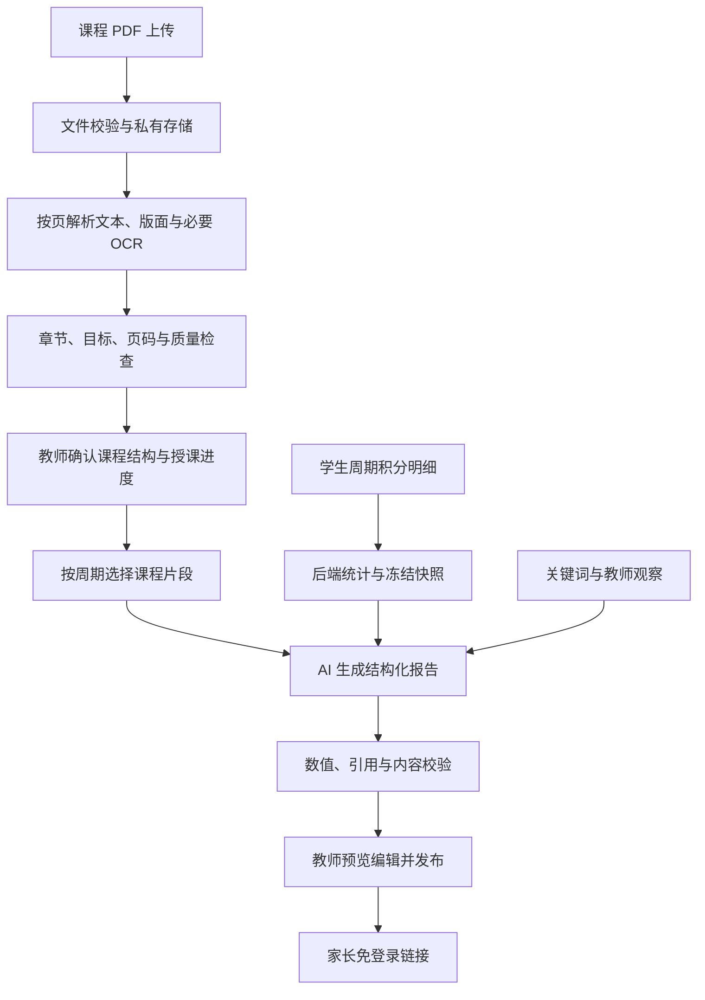

# 学期报告功能实施方案

日期：2026-09-27。工作分支：`featuer/semester-reports`，从本地 `main` 创建。

本方案已按确认的积分口径和可替换服务开始实施。代码包含教师端主流程、队列、私有 PDF 存储及免登录报告页；连接真实 OCR/AI 供应商和真实课程资料评测仍需环境凭据与样本。下列产品规则和容量限制是首版约定，需结合真实课程 PDF 继续验收。

已确认：AI 与 PDF 解析服务商暂不指定，采用可替换方案；首版继续使用综合积分生成各学科报告，仅预留将来按学科记分与筛选的扩展。

## 1. 功能范围与默认规则

统一入口叫「学期报告」，支持周报、月报、学期报告；一份报告对应一个学生、一个学科、一个明确日期区间。首版教师手动发起，周期表示统计范围，不表示自动定时生成。可多选学生批量生成，每名学生独立任务、独立报告和家长链接。

教师操作流程：

1. 建立学期（名称、开始与结束日期）及学科。
2. 为「学期 + 学科 + 年级/班级」上传课程 PDF，查看解析结果，确认章节、教学目标和授课进度。
3. 选择报告周期、学科、班级、学生，填写关键词；可另填具体的教师观察。
4. 查看本周期积分概览、课程范围、资料完整性提示，提交生成任务。
5. 后台生成草稿，教师查看依据、编辑正文并发布，获得免登录链接。
6. 历史列表查看生成流程、重试失败任务、重新生成新版本、复制或撤销链接、删除报告。

建议默认教师审核后发布；生成成功返回草稿 ID，发布成功返回家长链接。若产品决定直接生成并公开，可配置自动发布，但必须先通过同样的数据与输出校验。首版完整链路采用审核发布。

家长页采用移动端可滚动 HTML，包含学生姓名、学科、周期、课程内容、积分表现、成长亮点、待改进点和家庭建议。PDF 是输入资料；导出报告 PDF 可后续补充。

首版按现有教师账号隔离，各教师维护自己的学科和资料；不默认打通不同教师的学生、积分及教材。学校共享课程库、多教师协作归入后续范围。

## 2. 代码现状与必须解决的问题

| 已核查位置                                                             | 现状                                                                | 实施影响                                                                   |
| ---------------------------------------------------------------------- | ------------------------------------------------------------------- | -------------------------------------------------------------------------- |
| `apps/backend/src/pet-points/entities/pet-evaluation-record.entity.ts` | 有学生、类别、标签、分值、备注、创建时间，无学科                    | 按时间范围查询综合评价明细；预留可空学科字段                               |
| `apps/backend/src/pet-points/pet-points.service.ts`                    | 余额有零下限，兑换消耗余额，删除评价会回退并物理删除记录            | 报告统计评价分，不把余额当周期所得积分；生成时冻结事实快照                 |
| `apps/backend/src/pet-points/pet-points.database.ts`                   | 学生存在逻辑 ID 与带教师前缀的存储 ID，部分同步按班级和学号回退查找 | 新增明确的学生关联，不能只按姓名匹配积分                                   |
| `apps/backend/src/auth/teacher-context.ts`                             | 教师上下文依赖当前 HTTP 请求                                        | 后台 worker 使用显式 tenant/teacher 参数，不能直接依赖 request-scoped 服务 |
| `apps/web/app/api/backend-proxy.ts`                                    | 要求登录，使用 `request.text()` 转发正文，按 JSON 解析返回          | 文件上传使用专用二进制/流式通道；公开读取用单独接口                        |
| `apps/web/proxy.ts`                                                    | 普通业务页面未登录会跳转登录                                        | 精确放行家长报告路径，不放开全部报告管理接口                               |
| `apps/web/app/layout.tsx`                                              | 全局布局有居中与 `overflow-hidden`                                  | 为公开长报告实现独立滚动容器或路由布局，验收移动端长文                     |
| `deploy/compose.backend.yml`                                           | 后端 384MB 内存、Node heap 256MB；部署文档按 2C2G 设计              | 不把大型 OCR/视觉模型塞进现有后端进程                                      |

目前未发现既有课程 PDF 上传、文档解析、AI 生成或可靠后台任务模块，需要补齐这些能力。

## 3. 数据口径：先保证报告说的事实正确

### 周期

- 时区默认 `Asia/Shanghai`，保存具体起止时间和时区，SQL 使用 `[start, end)` 半开区间。
- 周报默认周一到下周一；月报按自然月；学期使用教师配置的校历日期，周/月范围与学期相交后展示实际范围。
- 当前尚未结束的周期，截止到提交任务时刻，标注「截至某日某时」；未来周期拒绝生成。
- 历史 MySQL DATETIME 的时区必须抽样核对，不直接假定旧数据均为 UTC；新增字段统一约定 UTC 存储和连接时区。

### 积分

- 后端确定性计算：加分合计、扣分绝对值合计、净评价分、评价次数、类别/标签分布、按周趋势，以及有限数量的代表性记录。
- 净评价分 = 本周期评价记录的 `SUM(delta_score)`，允许负值；与当前可兑换余额、宠物成长值明确区分。比如余额为 0 时记 -2，本周期评价分仍包含 -2。
- 奖品兑换不作为负面学习评价。手动调整单列，缺乏语义的「补分」不能解释为积极发言或学科能力。
- 已确认首版不改变加减分操作，使用学生当前周期的全部综合评价。不同学科报告复用同一份综合表现快照，各自结合对应课程 PDF 生成不同的学习建议，不把综合分重新命名为语文/数学等学科分。
- 数据层预留可空 `subject_id`，现有与首版新记录均为 NULL；统计策略记录 `score_scope=overall`。未来可开启学科选择并增加 `score_scope=subject`，届时按学科过滤、综合表现单列；服务端验证学科归属。旧报告保持原快照与统计策略，不随功能开启改变。
- 没有学科专属评价是首版预期情况，统一说明「表现依据来自综合积分，无法据此判断学科知识掌握程度」；没有任何评价记录时另说明资料不足，不表述为零努力或表现差。
- 未登记过的课堂表现不能当作未发生；评价频率可能不同，首版不做班级排名、掌握率、百分位或随意评分。
- 只有历史数据覆盖完整且口径一致时才提供周期比较；当前月未结束时不直接与整月比较总分。

### 学生关联和快照

在 `pet_points_students` 增加可空 `source_student_id`，关联统一学生表；同步学生时填写。历史回填先匹配同教师下逻辑 ID，再核对班级与学号；冲突或截断 ID 无法确认时要求修复映射，不用姓名强行合并。

报告读取仍带教师条件，积分关联到真实宠物学生存储 ID。生成时保存学生姓名/班级展示快照、统计明细摘要与来源 ID、统计截止时间、课程版本、进度版本和关键词。之后改名、删评价、换教材不静默修改已经发布的报告。

现有记录已经被删除的历史无法复原，界面明确报告基于当前留存记录，不声称有完整历史。后续转班数据没有历史班级字段时，也不推断原任课关系。生成前预览最终使用的记录范围。

教师在生成页面切换已选学生时，展示该学生于所选起止日期内的宠物积分加减合计和逐条记录。日期按上海时区解释，结束日期含当天，数据库用半开区间查询；预览只读当前教师可访问的学生。提交时重新计算并冻结积分，草稿和家长报告均显示该快照，编辑正文不得修改积分事实。总数和合计覆盖全部记录，逐条展示上限为 80 条并注明截断；家长端只收到标签、分值和时间，不收到内部 ID 或备注。旧报告从已保存快照补充显示，不根据现时积分重算。

报告区块称为「本期积分加减情况」。加分、扣分汇总可点击，分别筛选已展示明细中的正分、负分记录；净积分可点击恢复全部。筛选不改变全周期的汇总数字；明细被截断时明确提示筛选仅限已展示记录。教师端和家长端复用此交互，切换学生或周期后恢复查看全部。

## 4. PDF 处理：上传一次，解析复用

推荐首版使用私有对象存储 + 外部文档解析服务 + 可替换的文本生成模型。现有服务器保留业务逻辑、数据库任务队列和轻量结果处理。解析器与模型是两个独立接口，避免绑定同一家厂商。

### 上传与解析任务

1. 教师先选学期、学科、适用班级/年级、资料类型（教材、教学计划、补充资料）。每个课程资料集允许多个 PDF，每份有独立不可变版本。
2. 申请短期、限定对象路径和大小的上传凭证，浏览器直传私有对象存储；完成后服务端核实真实大小、签名、文件哈希、页数和所有权，再创建解析任务。不能只信扩展名、客户端 MIME 或完成回调。
3. 开发环境可用私有本地存储适配器和专用流式上传接口；文件不放 `public/`，生产有持久卷或对象存储，不落在随部署丢失的容器文件层。
4. 首版建议上限 30MB、300 页/文件，均可配置且不超过服务商限制；加密、损坏、伪造 PDF 给出明确错误。解析沙箱限制内存、耗时、页数和解压体积；不执行文档内脚本或访问文档内 URL。
5. 按页判断质量。正常文字页提取文本及阅读顺序；无文本、乱码或扫描页走 OCR；图片、公式、表格密集页用版面解析或视觉服务补充。混合 PDF 不能因为第一页有文字就跳过其余扫描页。
6. 标准化输出页级文本、标题层级、表格、必要图片说明、物理页码、印刷页码（若可识别）、块位置和质量标记。低质量相关页需要教师修正/补传；部分成功不能显示为全部解析完成。
7. AI 从这些结构提取课程单元、目标和关键词，每项绑定原始页码/块 ID；结构化结果仍需校验，原始解析内容保留供教师核对。
8. 以教师范围内的 `file_hash + parser_version + options + extraction_prompt_version` 去重缓存；跨教师不复用可见内容或索引。重试优先使用已完成结果。更新 PDF 创建新版本，不覆盖旧版。

### 整学期 PDF 如何对应一周或一个月

这比「把 PDF 交给大模型」更关键：教材包含一整学期内容，但未必包含实际授课日期。

- 教学计划中存在日期/周次时，解析为候选进度；教师确认学期起点、假期和实际调整。
- 仅有教材目录时，必须维护班级的章节授课日期/周次，或生成时手选本期已讲章节。不能默认按页数均分教学周。
- 数据结构记录 `class_id + term_id + subject_id + unit_id + start/end + confirmed_by`，允许同一本教材不同班级进度不同。
- 未确认授课范围时，生成前要求选章节，或显式采用「学期课程背景，未确认本期授课进度」模式；后一模式不声称本周已学某单元。

### 课程检索

先按教师、学期、学科、适用班级、已确认资料版本和授课范围过滤，再按单元/关键词取片段；第一页取样或整本截断不可作为检索方式。

首版每个资料集规模有限，可用章节索引及中文关键词匹配，保留足够的单元上下文与页码，不必立刻引入独立向量数据库。学期报告必须覆盖全部已确认教学单元，采用「单元摘要 + 总结」分层方式；周/月报告只取对应单元。上下文超预算时按单元压缩，不静默丢弃后半学期。

若真实资料验证显示语义召回不足，再增加向量或混合检索；所有检索仍先做权限与版本过滤。无相关片段时返回证据不足，不能跨学科补齐答案。

### 解析方案选择依据

| 方案                                  | 适用性                                                         | 首版结论                                 |
| ------------------------------------- | -------------------------------------------------------------- | ---------------------------------------- |
| 云文档解析/OCR                        | 减少现有服务器计算负担；需按真实中文、扫描、公式和表格样本验证 | 保留为后续可切换选项                     |
| 独立 Docling 解析服务                 | 本地 OCR/表格处理、页码文本；需要独立资源与运维                | 首版默认实现；真实课程样本仍需验收       |
| 每名学生直接发送整本 PDF 给多模态模型 | 小样本验证方便，但重复输入成本高，课程进度和引用不易统一       | 不作为生产主流程；可用于疑难页面补充解析 |

阿里云文档理解官方资料描述了电子版、扫描版、版面、层级和表格提取能力，可作为云解析候选，不能据此保证本项目教材识别质量：[文档理解](https://help.aliyun.com/zh/document-mind/product-overview/overview-of-document-understanding)。Docling 支持模型预下载、表格参数和文档资源限制，可用于独立解析服务验证：[官方高级配置](https://docling-project.github.io/docling/usage/advanced_options/)。厂商选择前先用真实 PDF 评测，不在方案阶段承诺准确率或单价。

## 5. AI 报告生成与质量约束

输入分成三组带标签的材料：课程证据、确定性积分统计/评价记录、教师输入。关键词是写作重点，例如「鼓励、表达能力、学习习惯」；「本月主动朗读两次」应放在教师观察字段并标明来源，不能把关键词本身当作事实。

采用固定 JSON schema，建议输出字段：`summary`、`courseOverview`、`strengths[]`、`areasToImprove[]`、`homeSuggestions[]`、`limitations[]`；每条叙述附 `sourceRefs[]`，标记为课程、评价或教师观察。姓名、学科、日期和所有数值卡片由后端快照填充，AI 不负责算数，也不返回 HTML。

具体约束：

- 课程证据只能证明课程内容，积分证据只能支持记录中的行为；「认真听讲 +2」不能推断「熟练掌握分数运算」。
- 建议可结合本期课程提出，但明确为练习建议，不能伪装成已验证的能力结论。
- 输入模型只用学生占位标识，服务端渲染姓名；不传学号、联系方式、全班名单。教师自由文本另做长度限制与可识别个人信息过滤。
- PDF、评价备注和关键词均视为资料，不能覆盖系统提示或触发工具执行；生成模型不提供网络、数据库写入或文件访问工具。
- 输出按 schema 校验长度、字段、引用 ID 归属与范围，数字与事实快照比对；不明来源、越权引用、错误数值或恶意内容阻止进入可发布状态。
- 格式错误可做一次受限修复，仍失败则保留失败状态及可读原因。语义真实性无法完全靠 schema 保证，教师预览是最后一层质量检查。
- 保存 provider/model、提示模板/schema 版本、输入哈希、token 用量、耗时和错误码；记录执行步骤，不记录或要求模型的隐式思考过程。
- 发布版只保存确认后的正文和公开字段；原始提示、内部备注、失败响应不向家长开放。

建议报告内容示例：课程为「分数的初步认识」，记录为「积极发言 3 次」。可以写「本期记录显示孩子有 3 次积极发言；家庭练习可结合分物品理解分数」，不能写「孩子已熟练掌握分数运算」。

## 6. 异步任务、流程记录和费用

首版使用 MySQL 持久化任务表，worker 独立启动入口并可独立部署，避免为低并发额外引入 Redis。不是 HTTP 请求中等待整份 PDF 解析或 AI 完成，也不使用请求结束即丢失的内存任务。

- 解析状态：`uploaded → queued → parsing → structuring → needs_review → ready`；异常进入 `failed`，删除进入 `deleted`。
- 报告任务：`queued → snapshotting → selecting_sources → generating → validating → succeeded`；支持 `failed/cancelled`。
- 报告生命周期：`draft → published → deleted`，分享链接另有 `active/revoked/expired`。重新生成创建草稿版本，不覆盖已发布版本；发布新版本才切换有效内容。
- 客户端提交返回 `202 + jobId/batchId`，轮询进度；刷新或关闭页面后可在任务列表恢复。批量中一个学生失败不影响其他学生。
- 任务创建与关键流程事件同事务落库；幂等键防止重复点击。worker 通过原子领取、租约、心跳和 attempt/fencing 标识防止重复完成，过期租约可恢复。
- 服务商返回任务 ID 后立即保存并轮询；超时优先查询原任务状态。外部调用不能保证绝对只计费一次，需记录尝试并限制重试；429/暂时网络错误指数退避，密码错误/格式错误不盲目重试。
- 运行时再次检查教师、资料、学生及报告是否仍有效；删除后取消待执行任务，旧 worker 即使收到 AI 返回也不能重新发布。
- worker 使用保存的 teacherId 显式作用域，所有数据库查询及对象存储访问都校验归属；不得接收客户端伪造的教师 ID。
- 初始并发建议全局 1 个解析、2 个生成，每教师 1 个生成；批量最多 30 人，可配置。上线前用实际容器预算压测，再调整。
- 流程事件包含步骤、起止时间、操作者、重试次数、错误原因、关联版本及费用信息；访问记录最多表示「链接被请求」，不能声称某位家长已阅读（链接预览机器人也会请求）。

费用结构：每份课程版本一次解析/OCR + 一次课程结构提取 + 每位学生每份报告的模型输入/输出费用 + 存储。UI 提交前展示人数、已缓存资料、预计消耗范围；单教师日/月限额、单任务输入/输出上限和重试预算可配置。缺少厂商价格时显示用量估算，不编造人民币价格。不得在运行时静默切换到未经配置的数据处理厂商。

## 7. 家长免登录链接、教师删除与内容保留

公开页建议 `/r/{token}`，后端只开放专用 `GET /public/reports/:token`。使用加密安全随机源生成 32 字节 token，以 base64url 编码，数据库存哈希并绑定报告及有效期。只有发布后签发 token；撤销或删除立即失效。

为支持教师在历史列表反复复制同一链接，另保存 token 的加密密文，仅所属教师的管理接口可解密取回。加密密钥放服务端密钥配置，与数据库分离，记录 key version 支持轮换；公开查询只使用 token 哈希。禁止日志记录明文 token。

- 链接只展示一份已发布报告，不提供学生 ID 查报告列表或访问原始课程 PDF 的入口。知道链接的人即可查看并可能转发，这是免登录设计的访问边界。
- 教师可设置到期时间、撤销或重新签发。公开页面和 API 每次读取都校验有效性；页面、数据、CDN 均 `no-store`，禁止 Next 静态生成或 ISR 缓存这类报告。
- `Referrer-Policy: no-referrer`、`X-Robots-Tag: noindex, nofollow, noarchive`，不出现在站点地图；不嵌入第三方分析脚本或外部图片。Nginx、应用日志和错误监控脱敏 token 路径。
- 公开请求做速率限制；无效、过期、已撤销、已删除均显示通用不可访问状态。返回 DTO 只允许已发布字段，不直接序列化实体。
- 删除仅限报告所属教师。事务内设置 tombstone、撤销全部 token、取消队列任务并记录删除事件，随后异步清理正文、快照和私有产物；失败重试并对账。
- 最小流程日志仅保留匿名报告 ID、操作、时间、操作者与清理状态，建议保留 90 天后清理；不能借审计名义永久保留完整学生报告。
- 上传的课程资料独立管理，删除某个学生报告不会删除其他报告仍使用的教材。资料删除需禁用新任务并清理该资料及派生索引；历史报告保存必要引用摘要和「源文件已删除」状态。
- 学生/教师账号删除应触发其公开链接撤销与关联内容清理，补充现有删除入口的集成。备份按部署保留策略到期清理，恢复时重放删除清单，避免已撤销内容重新公开。
- 已经被家长保存或截图的内容无法通过撤销链接追回；删除保证后续服务端访问失效。

## 8. 建议表结构与 API

所有业务表包含教师归属和创建/更新时间；关系写入必须校验同一教师，查询不得只用裸 ID。正式实现使用增量 TypeORM migration，并同步空库 `schema.sql`。

| 表/扩展                                         | 关键内容                                                              |
| ----------------------------------------------- | --------------------------------------------------------------------- |
| `academic_terms` / `subjects`                   | 学期日期、时区；教师学科字典及启用状态                                |
| `pet_points_students.source_student_id`         | 与统一学生表的明确映射                                                |
| `pet_points_evaluation_records.subject_id`      | 可空学科，历史记录保留空值                                            |
| `course_sets`                                   | 学期、学科、年级、资料集合；班级适用关系用关联表                      |
| `course_documents` / `course_document_versions` | 文件类型、私有对象键、哈希、大小、页数、解析状态、版本                |
| `course_chunks` / `course_units`                | 内容、章节、目标、页码、块引用及质量标记                              |
| `teaching_progress`                             | 班级周期到课程单元映射、确认状态与版本                                |
| `student_reports` / `report_versions`           | 学生、周期、科目、状态、发布版本；输入快照、正文 JSON、模型与模板版本 |
| `report_jobs` / `report_events`                 | 任务类型、租约、尝试、进度、幂等键、耗时、用量、错误及审计            |
| `report_shares`                                 | token 哈希、加密密文、密钥版本、报告、到期/撤销时间                   |

关键索引：评价 `(teacher_id, student_id, created_at)` 及按学科查询索引；报告 `(teacher_id, student_id, subject_id, period_start)`；任务 `(status, next_attempt_at, lease_until)`；token hash 唯一；任务幂等键在教师范围唯一。不要对学生/学科/周期做禁止重生成的唯一限制，使用报告版本区分。

| API（Nest 路径）                                                              | 用途                                                           |
| ----------------------------------------------------------------------------- | -------------------------------------------------------------- |
| `/academic-terms`、`/subjects`                                                | 登录教师的学期和学科维护                                       |
| `POST /course-documents/uploads`、`POST /course-documents/:id/complete`       | 申请上传、校验并启动解析                                       |
| `GET /course-documents/:id`、`POST /course-documents/:id/retry`               | 查看解析状态、失败重试                                         |
| `PATCH /course-documents/:id/structure`、`POST /course-documents/:id/confirm` | 修正并确认课程结构                                             |
| `/teaching-progress`                                                          | 设置和查询班级授课范围                                         |
| `POST /reports/preview-input`                                                 | 预览确定性统计、课程范围及资料缺口                             |
| `POST /reports/generate`                                                      | 周期、学科、班级、学生列表、关键词、观察、幂等键；返回任务集合 |
| `GET /reports/jobs/:id`、`POST /reports/jobs/:id/retry`                       | 状态/步骤、重试                                                |
| `GET /reports`、`GET /reports/:id`、`GET /reports/:id/events`                 | 历史、教师详情、流程记录                                       |
| `PATCH /reports/:id/draft`、`POST /reports/:id/publish`                       | 编辑草稿、发布并返回链接；使用版本号防止覆盖他人或旧页面编辑   |
| `POST /reports/:id/regenerate`                                                | 从最新数据创建新草稿，显式显示与旧版差异                       |
| `POST /reports/:id/shares`、`DELETE /reports/:id/shares/:shareId`             | 签发/替换、撤销链接                                            |
| `DELETE /reports/:id`、`DELETE /course-documents/:id`                         | 教师删除报告或课程资料                                         |
| `GET /public/reports/:token`                                                  | 唯一免登录报告读取，返回白名单 DTO                             |

Web BFF 为这些资源增加明确代理入口；公开接口不复用强制登录的 `proxyBackendRequest`。上传不经过其文本转换路径。所有新增输入做服务端 schema/DTO 校验、大小限制和嵌套资源归属验证。

## 9. 可执行开发顺序与完成标准

| 阶段            | 文件/模块落点                                                                                              | 交付与验收                                                                                                                                         |
| --------------- | ---------------------------------------------------------------------------------------------------------- | -------------------------------------------------------------------------------------------------------------------------------------------------- |
| 0：真实资料验证 | 脱敏测试夹具、解析器与模型评测脚本                                                                         | 用至少 3 类 PDF（文字、扫描、图表/公式）及匿名评价样本跑通解析→报告；教师核对章节、页码、OCR 错漏和措辞，记录每页/每报告成本与耗时；确定厂商和区域 |
| 1：数据基础     | `apps/backend/src/academic-terms/`、`subjects/`、`pet-points/`、`database/migrations/`                     | 学期/学科 CRUD、学生映射、综合积分周期 SQL 聚合、可空学科字段与统计策略扩展点；保持日常积分操作不变，旧数据兼容，无数据/跨周月边界测试通过         |
| 2：资料流程     | `course-materials/`、`jobs/`、`storage/`、`ai/` 适配器；Web 资料管理                                       | 私有上传、可恢复解析、结构预览修正、进度确认；刷新后任务恢复，更新资料保留版本                                                                     |
| 3：生成草稿     | `reports/`、独立 worker 入口及提示模板                                                                     | 快照、范围选择、结构化生成、规则校验、编辑和流程日志；首个真实单学生报告可核对依据                                                                 |
| 4：发布与家长页 | `apps/web/components/apps/SemesterReports.tsx`、`app/api/`、`app/r/[token]/page.tsx`、`proxy.ts`、布局适配 | 注册桌面入口；发布返回链接；手机/无痕窗口无需登录；撤销/删除后立即不可读                                                                           |
| 5：批量与上线   | worker 限流/配额、Compose、环境示例、CI、部署说明                                                          | 批量部分失败重试、进程重启恢复、成本上限、内存压测、灰度发布与清理任务验证                                                                         |

建议先完成阶段 0 的真实资料验证，再投入完整页面开发；其结果决定 OCR 选型、限制和成本。尚未提供实际课程 PDF，当前方案不代表真实解析效果已验收。

必须覆盖的测试：

- 教师 A 不能读取或关联教师 B 的 PDF、学科、学生、任务、报告，包含批量请求和后台 worker。
- 周/月/学期边界、时区、跨年、未结束周期；负分、兑换、手动调整、历史无学科和已删评价。
- 文本/扫描混合 PDF、密码/损坏文件、超限、重复上传、OCR 局部失败、伪造完成回调、旧版引用。
- 生成返回非法 JSON、引用不存在/越权、错误数字、PDF 指令注入、服务商超时/限流；证据不足不编造能力。
- 重复提交、租约过期与旧 worker 晚返回、生成期间删除、任务中途重启、快照后积分更改；不得重复发布或复活已删报告。
- 家长链接无痕访问、撤销/过期/删除失效；页面及 CDN 不保留可访问缓存；公开 DTO 无内部字段。
- 30 人批量的部分失败恢复、解析缓存复用、内存和队列积压；测试供应商 mock 保证 CI 不调用付费模型，真实模型另做小规模人工质量验收。

发布采用功能开关，先迁移新增表/可空字段，再部署后端和 worker，最后开放前端。保持旧积分流程兼容；回滚关闭入口和新任务，不执行会删除报告数据的 migration down。把私有文件、清理任务及公开链接撤销纳入恢复演练。

## 10. 当前待定项与默认取值

- 已确认 AI/OCR 厂商暂无指定，按可替换服务设计；具体厂商、数据处理区域和凭据仍待实施阶段配置。
- 已确认首版继续使用综合积分，预留学科选择扩展；报告始终标注综合数据，不能包装成学科积分。
- 发布方式：默认教师审核发布；家长查看不用登录。
- PDF 数量和质量、师生规模及预算：未知，先按上述保守限制做验证和配额，不能据此承诺吞吐和价格。

以上待定项不影响分支和方案交付；功能实施时先推进数据与接口骨架，真实 PDF 评测和厂商配置是验证 AI 质量的前置条件。
